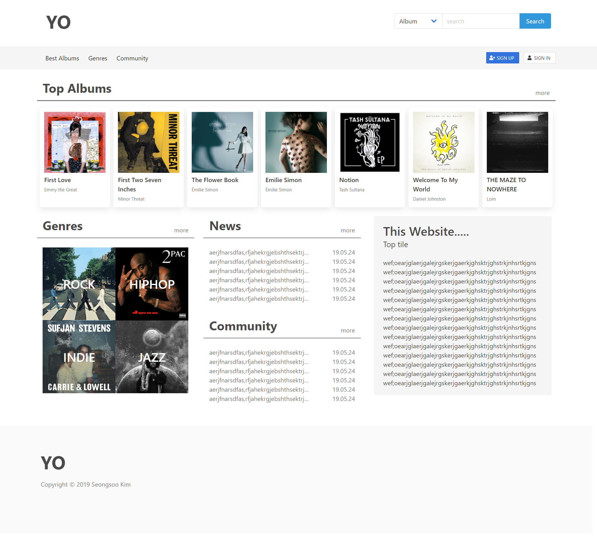
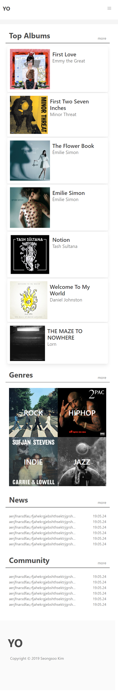

# YO (Your Opinion)

  HTML5, CSS3, Bulma, React.js, Node.js, MongoDB, Heroku  
  아직 진행중인 프로젝트입니다.  
  음악 정보를 API로 가져오고, 앨범마다 개별의 포스트가 생기며 댓글등으로 평점을 입력할 수 있도록 하는 서비스입니다. 
  Bulma를 이용하여 Flex Grid를 사용하여 반응형으로 제작되었습니다. 
  현재 페이지는 메인페이지, 로그인 페이지가 있으며 Node.js로 서버작업중인 단계입니다. 
  배포가 되면 링크가 업데이트 될 예정입니다. 
  음악 정보는 lastFM의 API를 사용하였습니다. 

  

메인페이지 비주얼 

 
모바일 비주얼 
